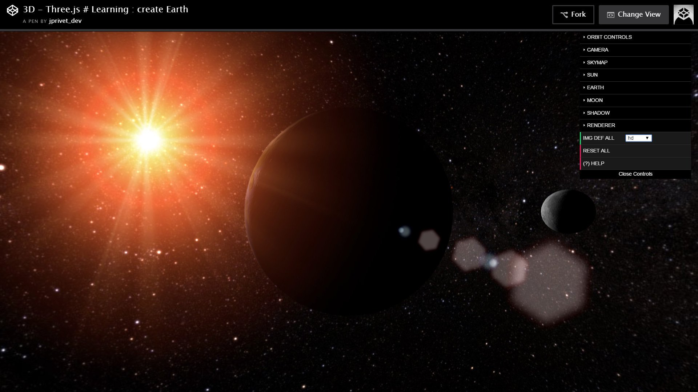
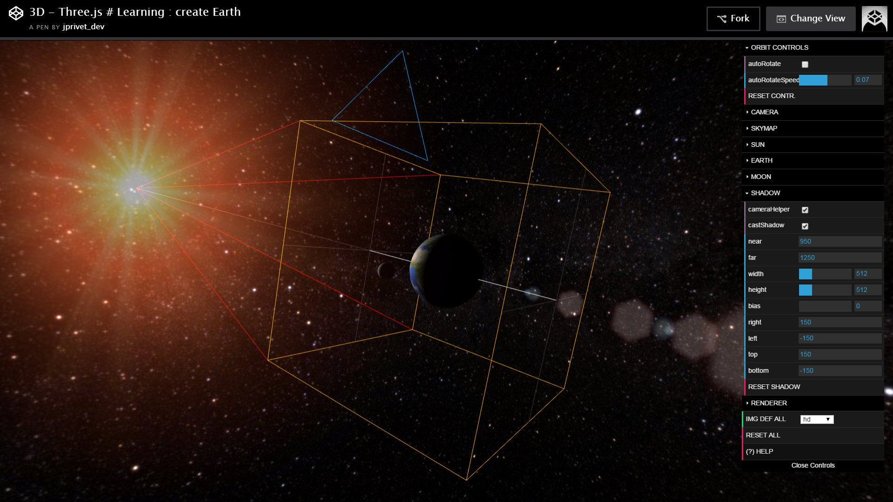
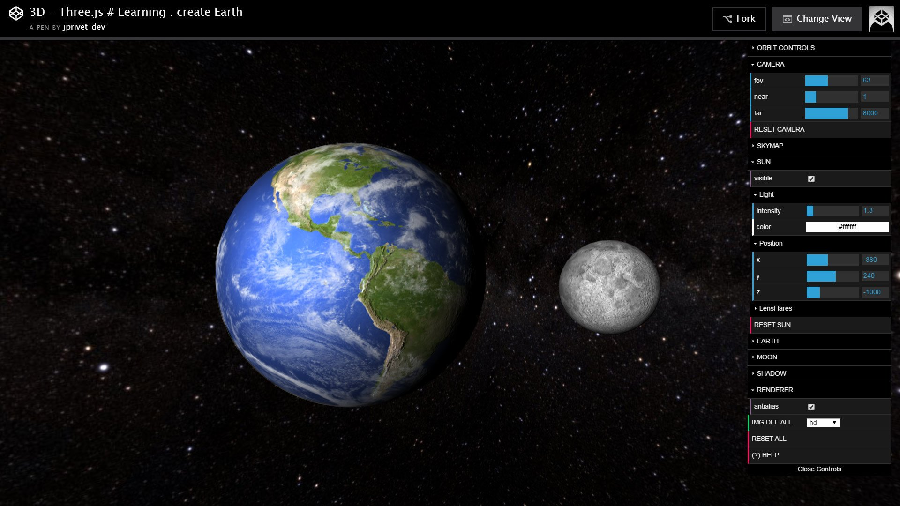
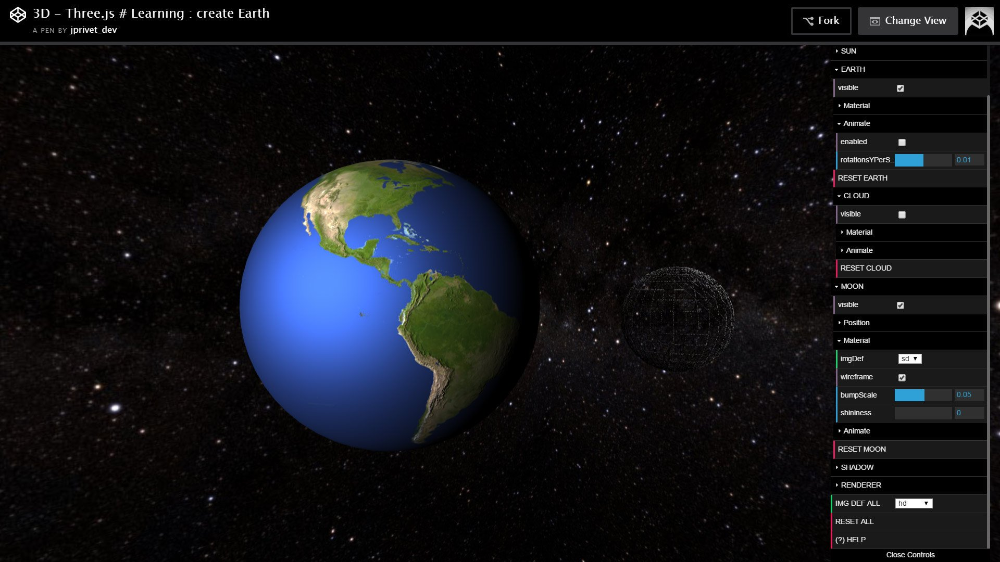

:toc: macro
:toc-title: Summary
:toclevels: 3
:numbered:

ifndef::env-github[:icons: font]
ifdef::env-github[]
:status:
:outfilesuffix: .adoc
:caution-caption: :fire:
:important-caption: :exclamation:
:note-caption: :paperclip:
:tip-caption: :bulb:
:warning-caption: :warning:
endif::[]

:back_to_top_target: top-target
:back_to_top_label: ⬆ Back to top
:back_to_top: <<{back_to_top_target},{back_to_top_label}>>

:main_title: Three.js: create Earth
:git_project: three.js-create-earth
:git_username: jprivet-dev
:git_url: https://github.com/{git_username}/{git_project}
:git_clone_ssh: git@github.com:{git_username}/{git_project}.git

[#{back_to_top_target}]
= {main_title}

toc::[]

== Presentation

Classic example, but very fun for testing and discovering Three.js :
with controls panel, change more than 70 parameters,
and play with Sun, Earth and Moon, lens flares, textures,
bump mapping, animations, lights, shadows, ...

Work in progress on https://jprivet-dev.github.io/three.js-create-earth/

Also a http://codepen.io/jprivet_dev/pen/QGaNdv[Pen]
by http://codepen.io/jprivet_dev[jprivet-dev]
on http://codepen.io/[CodePen]
(http://codepen.io/jprivet_dev/pen/QGaNdv/license[License]).









{back_to_top}

== Installation

=== Step #1: clone the project

[subs=attributes+]
```
$ git clone {git_clone_ssh}
```

=== Step #2: launch the project

Open the `index.html` file in your favorite browser.

{back_to_top}

== Resources & Inspiration

=== Examples

* https://stemkoski.github.io/Three.js/
* https://threejs.org/examples/

{back_to_top}

=== Earth

* http://learningthreejs.com/blog/2013/09/16/how-to-make-the-earth-in-webgl/
* http://blog.mastermaps.com/2013/09/creating-webgl-earth-with-threejs.html
* http://thematicmapping.org/playground/webgl/earth/

{back_to_top}

=== Skybox / Starmap

* https://threejs.org/examples/webgl_materials_cars.html
* https://threejs.org/examples/#css3d_panorama

{back_to_top}

=== Light

* https://threejs.org/examples/webgl_lensflares.html
* https://threejs.org/docs/api/lights/SpotLight.html

{back_to_top}

=== Shadow

* https://threejs.org/examples/webgl_shadowmap.html
* http://jsfiddle.net/4Txgp/13/

{back_to_top}

=== Controls

* https://github.com/mrdoob/three.js/blob/master/examples/js/controls/OrbitControls.js
* https://threejs.org/examples/misc_controls_orbit.html
* http://workshop.chromeexperiments.com/examples/gui

{back_to_top}

=== Animation

* https://github.com/mrdoob/three.js/issues/1830
* https://threejs.org/examples/webgl_animation_skinning_blending.html

{back_to_top}

=== Textures examples

* https://threejs.org/examples/webgl_materials_bumpmap.html
* https://developer.mozilla.org/en-US/docs/Web/API/WebGL_API/Tutorial/Using_textures_in_WebGL
* https://nasa3d.arc.nasa.gov/
* http://planetpixelemporium.com/earth.html
* http://earthobservatory.nasa.gov/blogs/elegantfigures/2011/10/06/crafting-the-blue-marble/
* http://visibleearth.nasa.gov/view.php?id=79765
* http://visibleearth.nasa.gov/view.php?id=57747

{back_to_top}

=== Textures used in this project

==== Earth

* https://s3-us-west-2.amazonaws.com/s.cdpn.io/122460/earth_bump_1024x512.jpg
* https://s3-us-west-2.amazonaws.com/s.cdpn.io/122460/earth_bump_2048x1024.jpg
* https://s3-us-west-2.amazonaws.com/s.cdpn.io/122460/earth_clouds_1024x512.jpg
* https://s3-us-west-2.amazonaws.com/s.cdpn.io/122460/earth_clouds_2048x1024.jpg
* https://s3-us-west-2.amazonaws.com/s.cdpn.io/122460/earth_map_1024x512.jpg
* https://s3-us-west-2.amazonaws.com/s.cdpn.io/122460/earth_map_2048x1024.jpg
* https://s3-us-west-2.amazonaws.com/s.cdpn.io/122460/earth_specular_1024x512.jpg
* https://s3-us-west-2.amazonaws.com/s.cdpn.io/122460/earth_specular_2048x1024.jpg

{back_to_top}

==== Lens flare

* https://s3-us-west-2.amazonaws.com/s.cdpn.io/122460/lens_flare_circle_32x32.jpg
* https://s3-us-west-2.amazonaws.com/s.cdpn.io/122460/lens_flare_circle_64x64.jpg
* https://s3-us-west-2.amazonaws.com/s.cdpn.io/122460/lens_flare_hexagon_256x256.jpg
* https://s3-us-west-2.amazonaws.com/s.cdpn.io/122460/lens_flare_hexagon_256x256.jpg
* https://s3-us-west-2.amazonaws.com/s.cdpn.io/122460/lens_flare_sun_1024x1024.jpg
* https://s3-us-west-2.amazonaws.com/s.cdpn.io/122460/lens_flare_sun_512x512.jpg

{back_to_top}

==== Moon

* https://s3-us-west-2.amazonaws.com/s.cdpn.io/122460/moon_bump_1024x512.jpg
* https://s3-us-west-2.amazonaws.com/s.cdpn.io/122460/moon_bump_512x256.jpg
* https://s3-us-west-2.amazonaws.com/s.cdpn.io/122460/moon_map_1024x512.jpg
* https://s3-us-west-2.amazonaws.com/s.cdpn.io/122460/moon_map_512x256.jpg

{back_to_top}

==== Skymap

* https://s3-us-west-2.amazonaws.com/s.cdpn.io/122460/skymap_negx_1024x1024.jpg
* https://s3-us-west-2.amazonaws.com/s.cdpn.io/122460/skymap_negx_512x512.jpg
* https://s3-us-west-2.amazonaws.com/s.cdpn.io/122460/skymap_negy_1024x1024.jpg
* https://s3-us-west-2.amazonaws.com/s.cdpn.io/122460/skymap_negy_512x512.jpg
* https://s3-us-west-2.amazonaws.com/s.cdpn.io/122460/skymap_negz_1024x1024.jpg
* https://s3-us-west-2.amazonaws.com/s.cdpn.io/122460/skymap_negz_512x512.jpg
* https://s3-us-west-2.amazonaws.com/s.cdpn.io/122460/skymap_posx_1024x1024.jpg
* https://s3-us-west-2.amazonaws.com/s.cdpn.io/122460/skymap_posx_512x512.jpg
* https://s3-us-west-2.amazonaws.com/s.cdpn.io/122460/skymap_posy_1024x1024.jpg
* https://s3-us-west-2.amazonaws.com/s.cdpn.io/122460/skymap_posy_512x512.jpg
* https://s3-us-west-2.amazonaws.com/s.cdpn.io/122460/skymap_posz_1024x1024.jpg
* https://s3-us-west-2.amazonaws.com/s.cdpn.io/122460/skymap_posz_512x512.jpg

{back_to_top}

== License

"{main_title}" is released under the {git_url}/blob/main/LICENSE[*MIT License*]

---

{back_to_top}


